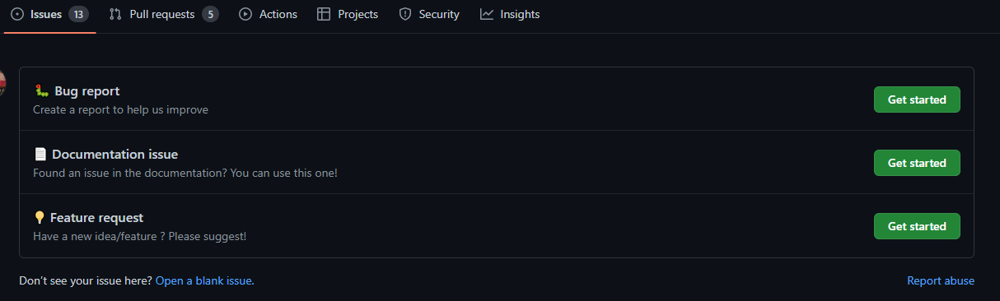

# Contributing to amazon clone

Hurray!, you're here!✨. This is the first step in making your contribution to the amazon clone project. This documentation will serve as a guide for making your contibutions to this project. Follow the steps stated below carefully.

Finally, we can't wait to see your outstanding issues and pull requests. Welcome 😇❤

# 📝 Table of Contents

- [Ground Rules](#rules)
- [PR guidelines ](#pr)
- [First Contribution](#first_contribution)
- [How to open Issue](#issue)
- [Gettin started](#get_started)
- [Raise PR](#raise_pr)
- [Review](#review)
- [Commit changes](#commit_changes)
- [Contributors](#contributors)

# Ground Rules <a name = "rules"></a>

Here at amazon clone, we welcome everyone to contribute to our project. You can contribute in several ways not just in code (E.g. Technical writing).

Having numerous means of contributing means working with alot of individuals which is very good for the growth 📈 of the project but most times can lead to conflicting interests and point of views 👈👉. Below are set of rules 📖 that guide individuals participating in this project.

- Openness 👐. Collaboration is only possible if everyone is open to share ideas.
- Respect 👨🏾‍🤝‍👨🏽. Having respect for everyone, their skills and opinions is paramount.
- Welcoming tone 😇💃: It is expected that you interact with others in an optimistic and cheerful manner.

# Things to take care while making a PR: <a name = "pr"></a>

- Don't forget to attach a screenshot of the final output of the work that you have done, and do mention the issue you have worked upon, while making a PR.
- Just make sure that you push only the files that you have worked upon.

# Your First Contribution <a name = "first_contribution"></a>

Is this your first time contributing to an open source project? If yes, Welcome!!✨🎉💃🏾 Here is a [great tutorial](https://app.egghead.io/playlists/how-to-contribute-to-an-open-source-project-on-github) on how to contribute to an open source project.

At this point you are ready to take on the world of open source contribution!!.

You must have seen a bug or problem you can fix, this is when you open a new issue for that problem. Let's do it together.

## Steps to open a new issue <a name = "issue"></a>

- **Step 1:** Navigate to the issues navigation button. See below 👇


- **Step 2:** Scan through the currently opened issues to see if your issue(s) has been listed earlier. See below 👇


- **Step 3:** If your issue hasn't been listed yet, click on the New issue button at the top right corner to add your new issue. See below 👇


- **Step 4:** Select the type of issue you want to raise. It's up to you whether you want to report a bug, a documentation issue or a feature request.



- **Step 5:** Time to add your amazing issue. You have to add the title and a brief description of the issue. For further explanation, images can be added as well. See below 👇


- **Step 6:** Submit the issue. See below 👇


Hurray, you just made added your first issue. The managers of amazon clone will now review your issue and you will either get assigned to the issue, have it closed or a comment will be dropped for you.

You have been assigned an issue 🥂 and are confused 😵 about where to go from here, follow this guide below to make your changes and pull request 🍾.

## Getting Started <a name = "get_started"></a>

_Skip all of the steps below by using Gitpod, which would automatically do all of that for you_

[](https://gitpod.io/#https://github.com/Kanika637/amazon-clone)

or

Fork the amazon clone repository. See below 👇


Clone the repository you forked above. See below 👇


Using the command below, you can clone the repo.

```
git clone https://github.com/Kanika637/amazon-clone.git
```

Navigate to the cloned directory using command line. See below 👇

```
cd amazon-clone
```

Install all the dependencies. See below 👇

```
npm i
```

Make a new branch. See below 👇


```

git checkout -b "Your Branch Name"
```

A good branch name would begin with the issue ticket and the assigned issue. See below 👇

```
// "#343" is the issue ticket number and "make a request" is the assigned issue name.

git checkout -b "#343-make a request"
```

You are all set!! 🍾🎉. You can now make your changes locally. Once you are done making all your changes, you can now push code and make a pull request.

## Steps for making a pull request <a name = "raise_pr"></a>

You have to switch to the main branch and make sure it's up to date with the amazon's clone main branch. To do so, use the following commands below.

```
git remote add upstream https://github.com/Kanika637/amazon-clone.git
git checkout main
git pull upstream main
```

You can now update your branch from your local copy of main, and push it!. See how below. 👇

```
git add .
git commit -m "<your commit message>"
git push origin <name-of-your-branch>
```

Hurray!!, we are done with the hard part. Head to github to make the pull request Github will check for conflicts and if non is found, you can make the pull request and the mainteners of amazon clone will review your pull request to have it merged or make a comment on it.

# Code review process <a name = "review"></a>

The maintainer of amazon-clone looks at Pull Requests on a regular basis and carries out merging or comments on the requests. You can close a pull request if it isn't showing any activity after two weeks.

## Commit messages <a name = "commit_changes"></a>

Amazon-clone has certain conventions that should be adopted when contributing.

### Commit message conventions.

- Commit test files with `test: ...` prefix
- Commit bug fixes with `fix: ...` prefix
- Commit new features with `feat: ...` prefix
- Commit changes to `package.json`, `.gitignore` and other meta files with `chore(filenamewithoutext): ...`
- Commit changes to README files or comments with `docs: ...`
- Cody style changes with `style: standard`

## Thanks to all Contributors <a name = "contributors"></a>

<a href="https://github.com/Kanika637/amazon-clone/graphs/contributors"> 
 
</a>

## Don't forgot to give a ⭐ to the repo, if you learned something!
